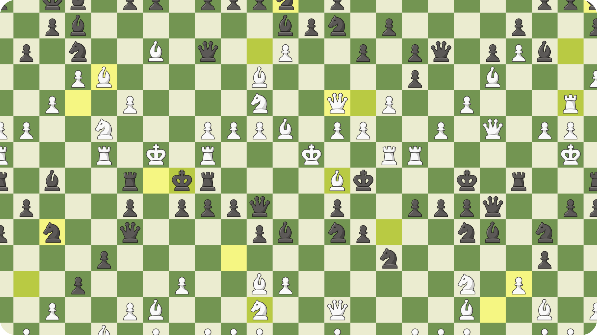
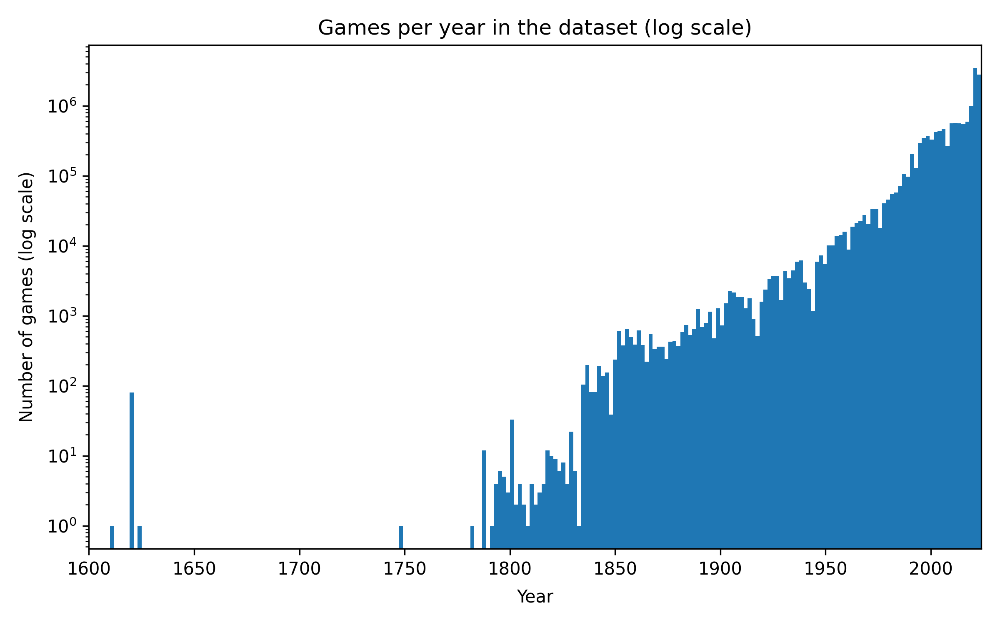
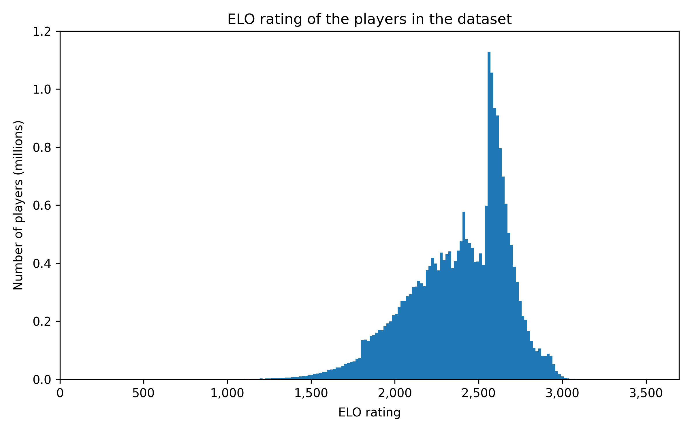
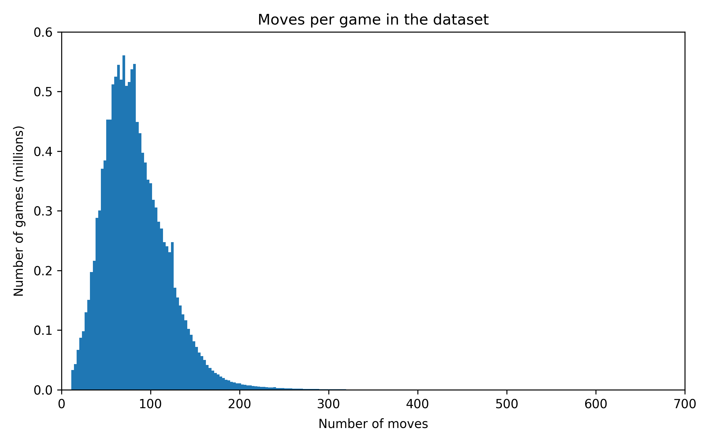
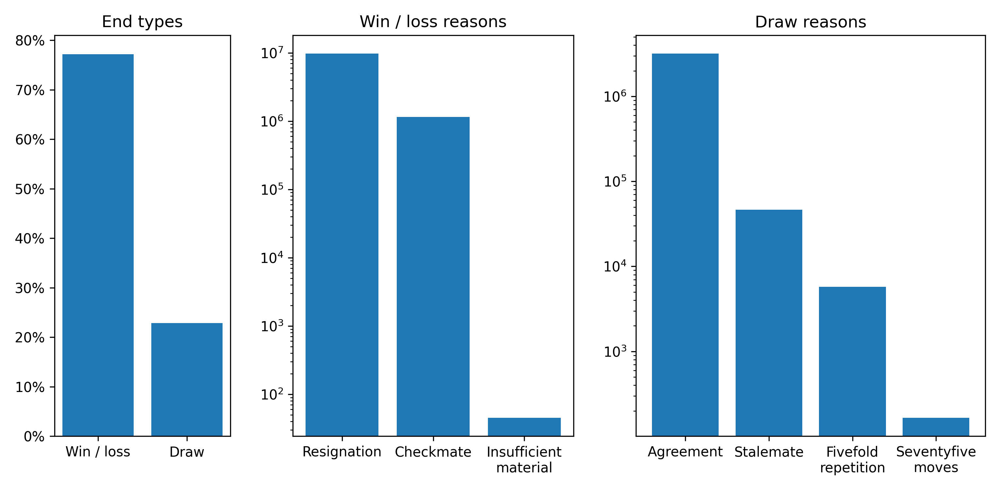

# ♟️ Chess games


The **Chess games dataset** is a collection of high level chess games for training machine learning models. The dataset is also available on [**Hugging Face 🤗**](https://huggingface.co/datasets/angeluriot/chess_games).

<p align="center">
	
</p>

<br/>

# 📋 Summary

* **[📋 Summary](#-summary)**
* **[📊 Overview](#-overview)**
* **[🗃️ Data Structure](#%EF%B8%8F-data-structure)**
* **[📝 Custom move notation](#-custom-move-notation)**
* **[🔗 Sources](#-sources)**
* **[🛠️ Usage](#%EF%B8%8F-usage)**
* **[📑 Example](#-example)**
* **[🙏 Credits](#-credits)**

<br/>

# 📊 Overview

The dataset is composed of 14M chess games from high level players for a total of 1.2B moves played between 1600 and 2024 (although most of them are recent):

<p align="center">
	
</p>

The mean ELO of the players is 2388:

<p align="center">
	
</p>

The mean number of moves per game is 84 (with a maximum of 692 moves):

<p align="center">
	
</p>

Most of the games were ended by a resignation or a draw agreement:

<p align="center">
	
</p>

<br/>

# 🗃️ Data Structure

Each record in the dataset follows the structure below:

```json
{
    "date": "date of the game (string like 'YYYY.MM.DD' or null)",
    "white_elo": "ELO of the white player (int or null)",
    "black_elo": "ELO of the black player (int or null)",
    "end_type": "how the game ended (string in ['resignation', 'checkmate', 'insufficient_material', 'draw_agreement', 'stalemate', 'fivefold_repetition', 'seventyfive_moves'])",
    "winner": "the winner of the game (string in ['white', 'black'] or null)",
    "moves_san": [
        "move in Standard Algebraic Notation (string, ex: 'Nxg3+')",
        ...
    ],
    "moves_uci": [
        "move in Universal Chess Interface (string, ex: 'h5f4')",
        ...
    ],
    "moves_custom": [
        "move in a custom notation for easier processing (string, ex: 'w.♘e2♘g3.x.+')",
        ...
    ],
    "source": "The source of the game (string)"
}
```

<br/>

# 📝 Custom move notation

The `moves_custom` field is a custom notation that gives more information about the moves, it's composed of 4 parts separated by a dot:

1. The color of the player (`w` for white and `b` for black)

2. The state of the moved pieces before and after the move:
	* For example, a **white knight** moving from **e2** to **g3** would be represented as: `♘e2♘g3`
	* If a piece change during the move, like a **white pawn** becoming a **white queen**, it would be represented as: `♙e7♛e8`
	* If multiple pieces are moved, like in a **white kingside castling**, it would be represented as: `♔e1♔g1♖h1♖f1`

3. `x` if a piece is captured during the move and `x*` if the capture is en passant

4. `+` if the move is a check and `+#` for checkmate

An impossible move with every parts could look like this: `w.♔e1♔g1♖h1♖f1.x*.+#`

<br/>

# 🔗 Sources

The table below shows the distribution of the games in the dataset by source:

<table>
	<thead>
		<tr>
			<th align="center">Source</th>
			<th align="center">Games</th>
			<th align="center">Ratio</th>
		</tr>
	</thead>
	<tbody>
		<tr>
			<td align="left"><b><a href="https://lichess.org/team/lichess-elite-database">Lichess Elite Database</a></b></td>
			<td align="center">5,525,245</td>
			<td align="center">38.94 %</td>
		</tr>
		<tr>
			<td align="left"><b><a href="https://lumbrasgigabase.com/en/">Lumbras Giga Base</a></b></td>
			<td align="center">3,701,341</td>
			<td align="center">26.09 %</td>
		</tr>
		<tr>
			<td align="left"><b><a href="https://www.pgnmentor.com/">PGN Mentor</a></b></td>
			<td align="center">3,431,537</td>
			<td align="center">24.19 %</td>
		</tr>
		<tr>
			<td align="left"><b><a href="https://theweekinchess.com/">The Week in Chess</a></b></td>
			<td align="center">858,163</td>
			<td align="center">6.05 %</td>
		</tr>
		<tr>
			<td align="left"><b>Masters</b></td>
			<td align="center">322,166</td>
			<td align="center">2.27 %</td>
		</tr>
		<tr>
			<td align="left"><b><a href="https://lichess.org/broadcast">Lichess Broadcast</a></b></td>
			<td align="center">105,329</td>
			<td align="center">0.74 %</td>
		</tr>
		<tr>
			<td align="left"><b><a href="https://chessok.com/">Chess OK</a></b></td>
			<td align="center">62,895</td>
			<td align="center">0.44 %</td>
		</tr>
		<tr>
			<td align="left"><b><a href="https://www.saund.co.uk/britbase/">BritBase</a></b></td>
			<td align="center">60,148</td>
			<td align="center">0.42 %</td>
		</tr>
		<tr>
			<td align="left"><b>KingBase</b></td>
			<td align="center">59,317</td>
			<td align="center">0.42 %</td>
		</tr>
		<tr>
			<td align="left"><b>Convekta</b></td>
			<td align="center">37,536</td>
			<td align="center">0.26 %</td>
		</tr>
		<tr>
			<td align="left"><b>Chess Nostalgia</b></td>
			<td align="center">24,592</td>
			<td align="center">0.17 %</td>
		</tr>
		<tr>
			<td align="left"><b><a href="https://www.chessopolis.com/">Chessopolis</a></b></td>
			<td align="center">123</td>
			<td align="center">&#60;0.01 %</td>
		</tr>
		<tr>
			<td align="left"><b>Games Of GMs</b></td>
			<td align="center">62</td>
			<td align="center">&#60;0.01 %</td>
		</tr>
		<tr>
			<th align="left"><b>Total</b></th>
			<th align="center"><b>14,188,454</b></th>
			<th align="center"><b>100.00 %</b></th>
		</tr>
</table>

Special thanks to <b><a href="https://lumbrasgigabase.com/en/">Lumbras Giga Base</a></b> for collecting the other sources, the games of this dataset are directly taken from their website.

<br/>

# 🛠️ Usage

The **Chess games dataset** is mainly intended for training machine learning models, but it can also be used for other purposes like data analysis or data visualization.

The simplest way to use the dataset is to load it directly from the **Hugging Face** library:

```console
pip install datasets
```

```py
from datasets import load_dataset

dataset = load_dataset('angeluriot/chess_games')

for game in dataset['train']:
    print(game['moves_san'])
    break
```

<br/>

# 📑 Example

```json
{
    "date": "2024.08.05",
    "white_elo": "2012",
    "black_elo": "1846",
    "end_type": "checkmate",
    "winner": "black",
    "moves_san": [
        "a3", "d5", "Nf3", "Nf6", "g3", "g6", "Bg2", "Bg7", "O-O", "O-O", "d3", "Nbd7", "Nbd2", "e5", "e4", "dxe4", "dxe4", "Re8", "Qe2", "Qe7", "b3", "Nc5", "Bb2", "Nfd7", "Rfd1", "Nf8", "Nc4", "f6", "Nfd2", "Be6", "Ne3", "c6", "a4", "Bf7", "Ndc4", "Red8", "b4", "Rxd1+", "Qxd1", "Rd8", "Qe2", "Nce6", "c3", "Nd7", "Ba3", "Nb6", "Nb2", "Qc7", "a5", "Nc8", "Nbc4", "Bf8", "Bc1", "h5", "h4", "Nd6", "Nb2", "Nb5", "Bd2", "Kh7", "Be1", "Bh6", "Nbc4", "Bf8", "Bf1", "Be7", "Qc2", "Kg7", "Nb2", "Nd6", "Rd1", "Bf8", "Nbc4", "Nb5", "Ra1", "Be7", "Na3", "Nd6", "Qb1", "Bf8", "Nec4", "Nxc4", "Nxc4", "Qd7", "a6", "b6", "Bh3", "Qe8", "Ne3", "Kh7", "Bf1", "Bh6", "Nc4", "Nc7", "Qc2", "Qd7", "Nb2", "Ne6", "Bc4", "Qe8", "Rd1", "Kg8", "Rxd8", "Qxd8", "b5", "cxb5", "Bxb5", "Nc5", "Qe2", "Kh7", "f3", "Qc8", "Bf2", "Bf8", "Kg2", "Be6", "Be3", "Be7", "Kf2", "Kg7", "Kg2", "Bh3+", "Kh2", "Be6", "Nd1", "Bf7", "Nf2", "Be6", "Nd1", "Bf7", "Bf2", "Nb3", "Qd3", "Bc5", "Be1", "Qc7", "Ne3", "Bxe3", "Qxe3", "Qc5", "Qxc5", "Nxc5", "Bf2", "Ne6", "c4", "Nc7", "Be3", "Be6", "Kg2", "Kf7", "Kf2", "Ke7", "Ke1", "Bc8", "Ba4", "Bxa6", "c5", "b5", "Bb3", "Bc8", "c6", "a6", "Bc5+", "Ke8", "Bb6", "Be6", "Bxc7", "Bxb3", "Kd2", "Ke7", "f4", "exf4", "gxf4", "Be6", "Kc3", "Bh3", "e5", "Bg2", "Bd6+", "Ke6", "c7", "Bb7", "Kb4", "fxe5", "fxe5", "Bc8", "Ka5", "Kd5", "Kb6", "b4", "Bxb4", "Kxe5", "Ka7", "g5", "hxg5", "h4", "Kb8", "Be6", "c8=Q", "Bxc8", "Kxc8", "h3", "Kc7", "Kf5", "Bd6", "a5", "g6", "Kxg6", "Kb6", "a4", "Kb5", "a3", "Bxa3", "h2", "Bc5", "h1=Q", "Kb6", "Qd5", "Kb5", "Kf5", "Kb6", "Ke6", "Kb5", "Qb3+", "Kc6", "Qc4", "Kb6", "Kd7", "Bf2", "Qb3+", "Ka7", "Qa2+", "Kb8", "Kc6", "Ba7", "Qg8#"
    ],
    "moves_uci": [
        "a2a3", "d7d5", "g1f3", "g8f6", "g2g3", "g7g6", "f1g2", "f8g7", "e1g1", "e8g8", "d2d3", "b8d7", "b1d2", "e7e5", "e2e4", "d5e4", "d3e4", "f8e8", "d1e2", "d8e7", "b2b3", "d7c5", "c1b2", "f6d7", "f1d1", "d7f8", "d2c4", "f7f6", "f3d2", "c8e6", "c4e3", "c7c6", "a3a4", "e6f7", "d2c4", "e8d8", "b3b4", "d8d1", "e2d1", "a8d8", "d1e2", "c5e6", "c2c3", "f8d7", "b2a3", "d7b6", "c4b2", "e7c7", "a4a5", "b6c8", "b2c4", "g7f8", "a3c1", "h7h5", "h2h4", "c8d6", "c4b2", "d6b5", "c1d2", "g8h7", "d2e1", "f8h6", "b2c4", "h6f8", "g2f1", "f8e7", "e2c2", "h7g7", "c4b2", "b5d6", "a1d1", "e7f8", "b2c4", "d6b5", "d1a1", "f8e7", "c4a3", "b5d6", "c2b1", "e7f8", "e3c4", "d6c4", "a3c4", "c7d7", "a5a6", "b7b6", "f1h3", "d7e8", "c4e3", "g7h7", "h3f1", "f8h6", "e3c4", "e6c7", "b1c2", "e8d7", "c4b2", "c7e6", "f1c4", "d7e8", "a1d1", "h7g8", "d1d8", "e8d8", "b4b5", "c6b5", "c4b5", "e6c5", "c2e2", "g8h7", "f2f3", "d8c8", "e1f2", "h6f8", "g1g2", "f7e6", "f2e3", "f8e7", "g2f2", "h7g7", "f2g2", "e6h3", "g2h2", "h3e6", "b2d1", "e6f7", "d1f2", "f7e6", "f2d1", "e6f7", "e3f2", "c5b3", "e2d3", "e7c5", "f2e1", "c8c7", "d1e3", "c5e3", "d3e3", "c7c5", "e3c5", "b3c5", "e1f2", "c5e6", "c3c4", "e6c7", "f2e3", "f7e6", "h2g2", "g7f7", "g2f2", "f7e7", "f2e1", "e6c8", "b5a4", "c8a6", "c4c5", "b6b5", "a4b3", "a6c8", "c5c6", "a7a6", "e3c5", "e7e8", "c5b6", "c8e6", "b6c7", "e6b3", "e1d2", "e8e7", "f3f4", "e5f4", "g3f4", "b3e6", "d2c3", "e6h3", "e4e5", "h3g2", "c7d6", "e7e6", "c6c7", "g2b7", "c3b4", "f6e5", "f4e5", "b7c8", "b4a5", "e6d5", "a5b6", "b5b4", "d6b4", "d5e5", "b6a7", "g6g5", "h4g5", "h5h4", "a7b8", "c8e6", "c7c8q", "e6c8", "b8c8", "h4h3", "c8c7", "e5f5", "b4d6", "a6a5", "g5g6", "f5g6", "c7b6", "a5a4", "b6b5", "a4a3", "d6a3", "h3h2", "a3c5", "h2h1q", "b5b6", "h1d5", "b6b5", "g6f5", "b5b6", "f5e6", "b6b5", "d5b3", "b5c6", "b3c4", "c6b6", "e6d7", "c5f2", "c4b3", "b6a7", "b3a2", "a7b8", "d7c6", "f2a7", "a2g8"
    ],
    "moves_custom": [
        "w.♙a2♙a3..", "b.♟d7♟d5..", "w.♘g1♘f3..", "b.♞g8♞f6..", "w.♙g2♙g3..", "b.♟g7♟g6..", "w.♗f1♗g2..", "b.♝f8♝g7..", "w.♔e1♔g1♖h1♖f1..", "b.♚e8♚g8♜h8♜f8..", "w.♙d2♙d3..", "b.♞b8♞d7..", "w.♘b1♘d2..", "b.♟e7♟e5..", "w.♙e2♙e4..", "b.♟d5♟e4.x.", "w.♙d3♙e4.x.", "b.♜f8♜e8..", "w.♕d1♕e2..", "b.♛d8♛e7..", "w.♙b2♙b3..", "b.♞d7♞c5..", "w.♗c1♗b2..", "b.♞f6♞d7..", "w.♖f1♖d1..", "b.♞d7♞f8..", "w.♘d2♘c4..", "b.♟f7♟f6..", "w.♘f3♘d2..", "b.♝c8♝e6..", "w.♘c4♘e3..", "b.♟c7♟c6..", "w.♙a3♙a4..", "b.♝e6♝f7..", "w.♘d2♘c4..", "b.♜e8♜d8..", "w.♙b3♙b4..", "b.♜d8♜d1.x.+", "w.♕e2♕d1.x.", "b.♜a8♜d8..", "w.♕d1♕e2..", "b.♞c5♞e6..", "w.♙c2♙c3..", "b.♞f8♞d7..", "w.♗b2♗a3..", "b.♞d7♞b6..", "w.♘c4♘b2..", "b.♛e7♛c7..", "w.♙a4♙a5..", "b.♞b6♞c8..", "w.♘b2♘c4..", "b.♝g7♝f8..", "w.♗a3♗c1..", "b.♟h7♟h5..", "w.♙h2♙h4..", "b.♞c8♞d6..", "w.♘c4♘b2..", "b.♞d6♞b5..", "w.♗c1♗d2..", "b.♚g8♚h7..", "w.♗d2♗e1..", "b.♝f8♝h6..", "w.♘b2♘c4..", "b.♝h6♝f8..", "w.♗g2♗f1..", "b.♝f8♝e7..", "w.♕e2♕c2..", "b.♚h7♚g7..", "w.♘c4♘b2..", "b.♞b5♞d6..", "w.♖a1♖d1..", "b.♝e7♝f8..", "w.♘b2♘c4..", "b.♞d6♞b5..", "w.♖d1♖a1..", "b.♝f8♝e7..", "w.♘c4♘a3..", "b.♞b5♞d6..", "w.♕c2♕b1..", "b.♝e7♝f8..", "w.♘e3♘c4..", "b.♞d6♞c4.x.", "w.♘a3♘c4.x.", "b.♛c7♛d7..", "w.♙a5♙a6..", "b.♟b7♟b6..", "w.♗f1♗h3..", "b.♛d7♛e8..", "w.♘c4♘e3..", "b.♚g7♚h7..", "w.♗h3♗f1..", "b.♝f8♝h6..", "w.♘e3♘c4..", "b.♞e6♞c7..", "w.♕b1♕c2..", "b.♛e8♛d7..", "w.♘c4♘b2..", "b.♞c7♞e6..", "w.♗f1♗c4..", "b.♛d7♛e8..", "w.♖a1♖d1..", "b.♚h7♚g8..", "w.♖d1♖d8.x.", "b.♛e8♛d8.x.", "w.♙b4♙b5..", "b.♟c6♟b5.x.", "w.♗c4♗b5.x.", "b.♞e6♞c5..", "w.♕c2♕e2..", "b.♚g8♚h7..", "w.♙f2♙f3..", "b.♛d8♛c8..", "w.♗e1♗f2..", "b.♝h6♝f8..", "w.♔g1♔g2..", "b.♝f7♝e6..", "w.♗f2♗e3..", "b.♝f8♝e7..", "w.♔g2♔f2..", "b.♚h7♚g7..", "w.♔f2♔g2..", "b.♝e6♝h3..+", "w.♔g2♔h2..", "b.♝h3♝e6..", "w.♘b2♘d1..", "b.♝e6♝f7..", "w.♘d1♘f2..", "b.♝f7♝e6..", "w.♘f2♘d1..", "b.♝e6♝f7..", "w.♗e3♗f2..", "b.♞c5♞b3..", "w.♕e2♕d3..", "b.♝e7♝c5..", "w.♗f2♗e1..", "b.♛c8♛c7..", "w.♘d1♘e3..", "b.♝c5♝e3.x.", "w.♕d3♕e3.x.", "b.♛c7♛c5..", "w.♕e3♕c5.x.", "b.♞b3♞c5.x.", "w.♗e1♗f2..", "b.♞c5♞e6..", "w.♙c3♙c4..", "b.♞e6♞c7..", "w.♗f2♗e3..", "b.♝f7♝e6..", "w.♔h2♔g2..", "b.♚g7♚f7..", "w.♔g2♔f2..", "b.♚f7♚e7..", "w.♔f2♔e1..", "b.♝e6♝c8..", "w.♗b5♗a4..", "b.♝c8♝a6.x.", "w.♙c4♙c5..", "b.♟b6♟b5..", "w.♗a4♗b3..", "b.♝a6♝c8..", "w.♙c5♙c6..", "b.♟a7♟a6..", "w.♗e3♗c5..+", "b.♚e7♚e8..", "w.♗c5♗b6..", "b.♝c8♝e6..", "w.♗b6♗c7.x.", "b.♝e6♝b3.x.", "w.♔e1♔d2..", "b.♚e8♚e7..", "w.♙f3♙f4..", "b.♟e5♟f4.x.", "w.♙g3♙f4.x.", "b.♝b3♝e6..", "w.♔d2♔c3..", "b.♝e6♝h3..", "w.♙e4♙e5..", "b.♝h3♝g2..", "w.♗c7♗d6..+", "b.♚e7♚e6..", "w.♙c6♙c7..", "b.♝g2♝b7..", "w.♔c3♔b4..", "b.♟f6♟e5.x.", "w.♙f4♙e5.x.", "b.♝b7♝c8..", "w.♔b4♔a5..", "b.♚e6♚d5..", "w.♔a5♔b6..", "b.♟b5♟b4..", "w.♗d6♗b4.x.", "b.♚d5♚e5.x.", "w.♔b6♔a7..", "b.♟g6♟g5..", "w.♙h4♙g5.x.", "b.♟h5♟h4..", "w.♔a7♔b8..", "b.♝c8♝e6..", "w.♙c7♕c8..", "b.♝e6♝c8.x.", "w.♔b8♔c8.x.", "b.♟h4♟h3..", "w.♔c8♔c7..", "b.♚e5♚f5..", "w.♗b4♗d6..", "b.♟a6♟a5..", "w.♙g5♙g6..", "b.♚f5♚g6.x.", "w.♔c7♔b6..", "b.♟a5♟a4..", "w.♔b6♔b5..", "b.♟a4♟a3..", "w.♗d6♗a3.x.", "b.♟h3♟h2..", "w.♗a3♗c5..", "b.♟h2♛h1..", "w.♔b5♔b6..", "b.♛h1♛d5..", "w.♔b6♔b5..", "b.♚g6♚f5..", "w.♔b5♔b6..", "b.♚f5♚e6..", "w.♔b6♔b5..", "b.♛d5♛b3..+", "w.♔b5♔c6..", "b.♛b3♛c4..", "w.♔c6♔b6..", "b.♚e6♚d7..", "w.♗c5♗f2..", "b.♛c4♛b3..+", "w.♔b6♔a7..", "b.♛b3♛a2..+", "w.♔a7♔b8..", "b.♚d7♚c6..", "w.♗f2♗a7..", "b.♛a2♛g8..+#"
    ],
    "source": "LichessBroadcast"
}
```

<br/>

# 🙏 Credits

* [**Angel Uriot**](https://github.com/angeluriot): the creator of the project
* [**Lumbras Giga Base**](https://lumbrasgigabase.com/en/): for collecting the games of the dataset
* All the original sources of the games, see the [**Sources**](#sources) section for more information
* All the players featured in the games of the dataset
